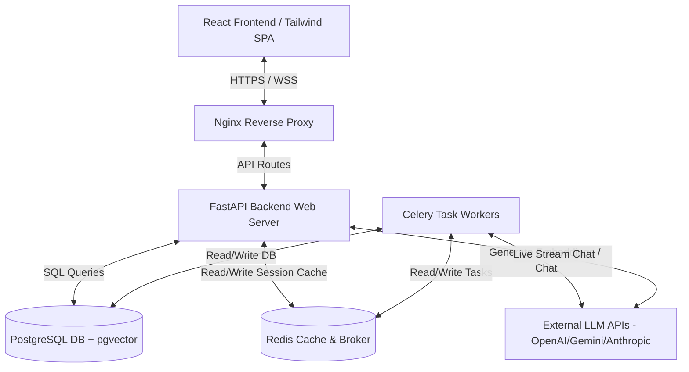
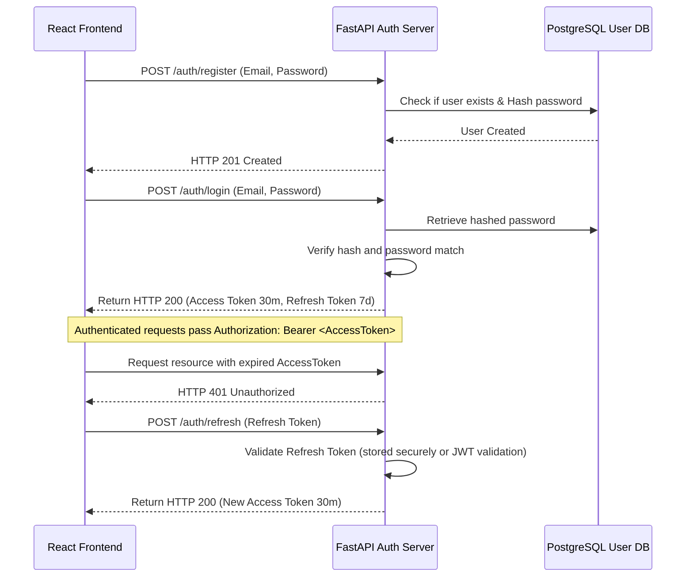
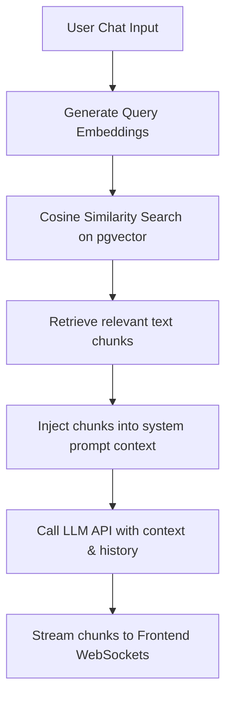

# EduTwin AI - Architecture Design Document

This document outlines the system architecture, component integrations, data flow, AI/RAG patterns, analytics tracking, security policies, and implementation roadmap for **EduTwin AI**, a production-grade virtual tutor companion.

---

## 1. System Architecture

EduTwin AI is designed as a decoupled, multi-container microservice system that scales independently.



### Component Details
1. **Nginx Reverse Proxy**: Directs static asset requests to the frontend client and routes API queries `/api/v1` to the FastAPI web server. Manages SSL termination and basic rate limiting.
2. **React SPA**: Executed on the client browser. Provides responsive interface with custom Tailwind styling and persistent WebSockets for live voice/text chat streaming.
3. **FastAPI Web Server**: High-performance, asynchronous web server written in Python. Handles routing, authentication, API controller logic, and routes CPU-bound or scheduled work to Celery workers.
4. **PostgreSQL + pgvector**: Core persistent relational storage. Relies on `pgvector` to store and query text chunks and embeddings for localized context injection (RAG).
5. **Redis Cache & Broker**: Acts as the message broker for Celery queues and holds volatile cache data (such as active user sessions and rate-limiting bucket counters).
6. **Celery Worker & Beat**: Runs asynchronous background computations such as generating spaced repetition flashcards, calculating weekly performance analytics, and sending automated progress digests.

---

## 2. Database Schema & Rationale

We use a relational database structure designed to track learning progression, chat logs, user performance, and structured materials.

### Relational Schema Rationale
- **Users and User Profiles**: Split into separate tables to optimize authentication lookup queries vs. rich profile information (preferences, subjects).
- **Learning Sessions & Chat Messages**: Sessions group related student-tutor dialogues. Messages are chronologically bound to a session and reference document chunks to show what RAG sources were used for the answer.
- **Knowledge Base and Chunks**: Handles learning materials. Documents are chunked, and each chunk has an associated high-dimensional vector field (`vector(1536)`) for cosine-similarity queries.
- **Spaced Repetition Cards (Flashcards)**: Integrates learning theory (SuperMemo-2 algorithm) to recommend cards based on user feedback intervals.
- **Analytics Events**: Track interface telemetry (e.g., page views, quiz attempts, answer duration) to feed the analytics scoring engine.

*Detailed SQL definitions are in [DATABASE_SCHEMA.md](file:///c:/Users/ASHWITH%20REDDY/OneDrive/Desktop/AI%20Tutor/DATABASE_SCHEMA.md).*

---

## 3. Folder Structure

We enforce a strict separation of concerns for components:

```text
ai-tutor/
├── backend/
│   ├── app/
│   │   ├── api/            # API Route definitions
│   │   │   ├── auth.py     # Login, registration, token refresh
│   │   │   ├── chat.py     # Dialogue sessions and message stream
│   │   │   └── stats.py    # Analytics endpoints and performance reports
│   │   ├── core/           # Configuration files
│   │   │   ├── config.py   # Environment variable schemas (Pydantic)
│   │   │   ├── database.py # SQLAlchemy session registry
│   │   │   ├── security.py # JWT signing, password hashing (bcrypt)
│   │   │   └── celery.py   # Celery worker application configuration
│   │   ├── models/         # ORM models (SQLAlchemy)
│   │   ├── schemas/        # Request/Response schemas (Pydantic validation)
│   │   ├── services/       # Business modules
│   │   │   ├── ai.py       # LLM interface and RAG search logic
│   │   │   └── analytics.py# Telemetry tracking & scoring algorithms
│   │   └── tasks/          # Celery task definitions
│   │       ├── sync.py     # Scheduled db cleanups or sync jobs
│   │       └── digest.py   # Spaced repetition schedule scoring
│   └── tests/              # Pytest backend validation suites
└── frontend/
    └── src/
        ├── assets/         # CSS style declarations, brand icons
        ├── components/     # Reusable UI widgets
        │   ├── common/     # Buttons, inputs, containers
        │   ├── chat/       # Streaming logs, audio visualizers
        │   └── dashboard/  # Analytics chart widgets, study streaks
        ├── context/        # React context instances (AuthContext, ThemeContext)
        ├── hooks/          # Custom hooks wrapping axios calls & websocket events
        ├── layouts/        # Root layouts (Dashboard, Landing page, Auth)
        ├── pages/          # Complete page components
        └── services/       # Axios wrappers and API endpoints
```

---

## 4. API Endpoints Strategy

All HTTP APIs follow REST principles, returning JSON payloads and standard status codes.

### Principles:
1. **Versioning**: Prefixed with `/api/v1/` to support future non-breaking updates.
2. **Statelessness**: No cookie sessions; authentication is passed in headers using JWTs (`Authorization: Bearer <token>`).
3. **Response Envelope**: Output structures follow strict Pydantic schemas. Errors return consistent envelopes:
   ```json
   {
     "detail": "Descriptive error message string"
   }
   ```
4. **WebSocket Connection**: Real-time communication is established at `/api/v1/chat/ws/{session_id}` for low-latency streaming of tutor responses and audio interaction.

---

## 5. Authentication Flow

We employ a robust, stateless JWT authentication flow with refresh tokens to maintain a secure user session lifecycle.



- **Password Storage**: Passwords are secure hashed using `bcrypt` (rounds=12).
- **Access Tokens**: Short-lived (30 minutes) containing user UUID and role claims in JWT payload.
- **Refresh Tokens**: Long-lived (7 days) stored securely in user local store or Secure HTTPOnly cookies.

---

## 6. AI Architecture & RAG Pipeline

EduTwin AI combines standard Large Language Models (LLM) with a Retrieval-Augmented Generation (RAG) pipeline to keep responses grounded in uploaded textbooks and materials.



### LLM Orchestration Service:
- **System Prompting**: Configures the virtual tutor identity, formatting styles (markdown equations, code syntax), and instructions to output citations only from injected context.
- **pgvector Vector Database**: Matches the user query embedding (1536 dimensions, calculated via OpenAI `text-embedding-3-small` or similar) to text chunk embeddings stored in `document_chunks`.
- **Active Memory**: Historical conversational turns within the session are kept up to a window threshold to preserve context while controlling token count.

---

## 7. Analytics Engine

The Analytics Engine computes academic progress and engagement indicators.

### Key Metrics Tracked:
1. **Retention Index**: Computed from performance records on Spaced Repetition Cards (flashcards).
2. **Subject Mastery**: Percentage scores based on quiz performance across specific tags (e.g. "Physics", "Computer Science").
3. **Study Streak**: Number of consecutive days the user has posted telemetry events.
4. **Dialogue Dynamics**: Duration of chat sessions, count of prompt tokens, and sentiment indicators derived from user queries.

- *Data Capture*: Tracked via `/api/v1/analytics/event` POST requests mapped to a user uuid.
- *Batch Calculations*: A Celery cron worker processes individual events daily, aggregating metrics and updating `user_profiles` caching indicators for the frontend dashboard.

---

## 8. Security Specifications

Production configuration mandates the following security measures:

1. **Transport Encryption**: Force HTTP Strict Transport Security (HSTS) with Nginx redirecting all traffic from `http` to `https`.
2. **Cross-Origin Resource Sharing (CORS)**: Strict whitelist in FastAPI middleware using variables defined in `.env`.
3. **Database Security**:
   - Connection pools use SSL.
   - Database credentials are kept in system environment variables, isolated inside the Postgres container.
   - SQL queries are executed exclusively using SQLAlchemy ORM parametrized builders to eliminate SQL Injection vectors.
4. **Rate Limiting**: Integrated using Redis Token Bucket strategy. Limits endpoint hits:
   - Auth endpoints: Max 10 requests per minute per IP.
   - Chat endpoints: Max 30 requests per minute per IP.
5. **Token Security**: JWT claims contain an expiration timestamp (`exp`). Refresh tokens are verified for database status verification before issuing new access tokens.

---

## 9. Project Roadmap

```text
┌────────────────────────┐
│  Phase 1: Planning     │ ◄-- CURRENT PHASE
├────────────────────────┤
│ - Establish directory structure & Docker configs.
│ - Finalize database DDL schema specs.
│ - Write architecture documentation and API specs.
└───────────┬────────────┘
            ▼
┌────────────────────────┐
│  Phase 2: Backend Dev  │
├────────────────────────┤
│ - Setup FastAPI skeleton, DB connections, and migrations.
│ - Write authentication routing & user profiles logic.
│ - Integrate pgvector schemas & RAG vector search.
│ - Deploy Celery background tasks & workers.
└───────────┬────────────┘
            ▼
┌────────────────────────┐
│  Phase 3: Frontend Dev │
├────────────────────────┤
│ - Construct React app shell & set up Tailwind styling.
│ - Implement authentication context & state managers.
│ - Build chat container & web socket clients.
│ - Design Analytics dashboards & flashcard widgets.
└───────────┬────────────┘
            ▼
┌────────────────────────┐
│  Phase 4: Ship & Ops   │
├────────────────────────┤
│ - Perform load testing & scale web-socket workers.
│ - Setup CI/CD build scripts & Docker registry pipelines.
│ - Enable telemetry logs (Sentry/Datadog).
└────────────────────────┘
```
